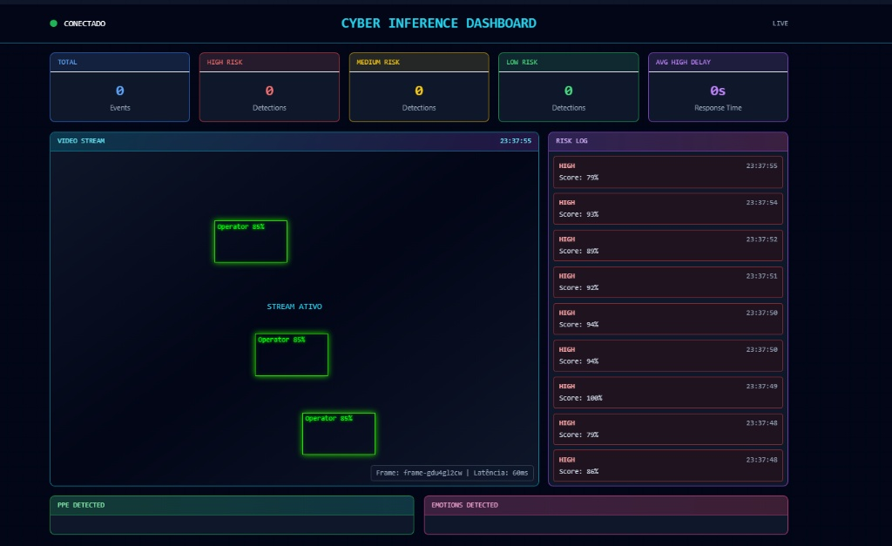

# 🧠 Tech Test - Full Stack AI Platform

Plataforma de análise de vídeo em tempo real com Inteligência Artificial, desenvolvida como teste técnico.



## 🚀 Visão Geral
Aplicação Full Stack (Monorepo) que simula um sistema de inferência de IA para detecção de EPIs e análise de risco em tempo real.
- **Frontend:** Dashboard interativo com tema Cyberpunk, recebendo dados via WebSocket.
- **Backend:** API robusta com persistência de dados e streaming de eventos.

## 🛠️ Tecnologias Utilizadas
- **Backend:** NestJS, Mongoose (MongoDB), Socket.io, Passport (Google OAuth).
- **Frontend:** Nuxt 3, Tailwind CSS, Pinia, Socket.io-client.
- **Arquitetura:** Provider Pattern, WebSocket Gateway, Repository Pattern.

## ⚙️ Como Executar

### Pré-requisitos
- Node.js (v18+)
- MongoDB (Rodando localmente na porta 27017)

### Passo a Passo

1. **Clone o repositório:**
   ```bash
   git clone <SEU_LINK_DO_GIT_AQUI>
   cd Projeto-Teste
   ```

2. **Instale as dependências:**

   **Backend:**
   ```bash
   cd backend
   npm install
   ```

   **Frontend:**
   ```bash
   cd ../frontend
   npm install
   ```

3. **Configure as variáveis de ambiente:**

   **Backend (`backend/.env`):**
   ```env
   DATABASE_URL=mongodb://localhost:27017/emiolo_test
   GOOGLE_CLIENT_ID=<SEU_CLIENT_ID>
   GOOGLE_CLIENT_SECRET=<SEU_CLIENT_SECRET>
   JWT_SECRET=secret_key_test
   FRONTEND_URL=http://localhost:3001
   ```

   **Frontend (`frontend/.env`):**
   ```env
   NUXT_PUBLIC_API_URL=http://localhost:3000
   NUXT_PUBLIC_BACKEND_URL=http://localhost:3000
   ```

4. **Inicie MongoDB:**
   ```bash
   mongod --dbpath <caminho_para_dados>
   ```
   Ou use Docker:
   ```bash
   docker run -d -p 27017:27017 --name mongodb mongo:latest
   ```

5. **Execute o Backend:**
   ```bash
   cd backend
   npm run start:dev
   ```
   Backend rodará em: `http://localhost:3000`

6. **Em outro terminal, execute o Frontend:**
   ```bash
   cd frontend
   npm run dev
   ```
   Frontend rodará em: `http://localhost:3001`

7. **Acesse a aplicação:**
   - **Home:** http://localhost:3001
   - **Login:** Clique em "Login" e autentique com Google
   - **Usuários:** http://localhost:3001/users
   - **Star Wars API:** http://localhost:3001/starwars
   - **Dashboard:** http://localhost:3001/dashboard

## 📁 Estrutura do Projeto

```
Projeto-Teste/
├── backend/
│   ├── src/
│   │   ├── app.module.ts
│   │   ├── main.ts
│   │   ├── auth/
│   │   │   ├── auth.module.ts
│   │   │   ├── auth.service.ts
│   │   │   ├── google.strategy.ts
│   │   │   └── jwt.strategy.ts
│   │   ├── users/
│   │   │   ├── users.module.ts
│   │   │   ├── users.service.ts
│   │   │   ├── users.controller.ts
│   │   │   └── schemas/
│   │   │       └── user.schema.ts
│   │   ├── swapi/
│   │   │   ├── swapi.module.ts
│   │   │   ├── swapi.service.ts
│   │   │   └── swapi.controller.ts
│   │   └── inference/
│   │       ├── inference.module.ts
│   │       ├── inference.service.ts
│   │       ├── inference.controller.ts
│   │       ├── inference.gateway.ts
│   │       ├── providers/
│   │       │   ├── inference.provider.ts
│   │       │   └── mock.provider.ts
│   │       └── schemas/
│   │           └── event.schema.ts
│   ├── package.json
│   └── .env
├── frontend/
│   ├── pages/
│   │   ├── index.vue
│   │   ├── users.vue
│   │   ├── starwars.vue
│   │   └── dashboard.vue
│   ├── components/
│   │   └── MetricCard.vue
│   ├── middleware/
│   │   └── auth.ts
│   ├── stores/
│   │   └── auth.ts
│   ├── layouts/
│   │   └── default.vue
│   ├── nuxt.config.ts
│   ├── package.json
│   └── .env
├── docker-compose.yml
├── .gitignore
└── README.md
```

## 🎯 Funcionalidades Implementadas

### Backend

#### 1. **Módulo de Autenticação (Auth)**
- ✅ Google OAuth2 com Passport
- ✅ JWT Token gerado no backend e armazenado em cookie no frontend
- ✅ Endpoints:
  - `GET /auth/google` → Iniciar login com Google
  - `GET /auth/google/callback` → Callback do Google
  - `POST /auth/logout` → Logout do usuário

#### 2. **Módulo de Usuários**
- ✅ CRUD de usuários integrado com MongoDB
- ✅ Endpoints:
  - `GET /users` → Listar todos os usuários
  - `POST /users` → Criar novo usuário
  - `GET /users/:id` → Buscar usuário por ID
  - `PATCH /users/:id` → Atualizar usuário
  - `DELETE /users/:id` → Deletar usuário

#### 3. **Módulo SWAPI (Star Wars API)**
- ✅ Integração com Star Wars API pública
- ✅ Endpoints:
  - `GET /swapi/people` → Listar personagens (com paginação)
  - `GET /swapi/planets` → Listar planetas (com paginação)

#### 4. **Módulo de Inferência (Parte 2)**
- ✅ Provider Pattern para abstrair implementações
- ✅ MockProvider com dados simulados e latência aleatória (100-500ms)
- ✅ WebSocket Gateway para streaming em tempo real (500ms de intervalo)
- ✅ Persistência de eventos em MongoDB com agregações
- ✅ Endpoints:
  - `POST /inference/frames` → Processar um frame individual
  - `GET /inference/metrics` → Obter métricas agregadas (total eventos, distribuição de risco, PPE, emoções)

#### 5. **WebSocket Gateway**
- ✅ Emite dados de inferência a cada 500ms via Socket.io
- ✅ Estrutura de payload:
  ```json
  {
    "ts": "2025-12-04T10:30:45.123Z",
    "frameId": "frame_12345",
    "overlay": {
      "boxes": [
        { "x": 10, "y": 20, "w": 30, "h": 40, "label": "helmet", "confidence": 0.95, "color": "#00ff00" }
      ],
      "emotions": [
        { "label": "happy", "score": 0.8 },
        { "label": "neutral", "score": 0.2 }
      ],
      "risk": { "level": "HIGH", "score": 0.75, "reasons": ["low PPE coverage"] }
    }
  }
  ```
- ✅ Persistência automática de cada evento em MongoDB
- ✅ Métricas agregadas em tempo real

#### 6. **Event Schema (MongoDB)**
- ✅ Campos: `timestamp` (indexed), `type`, `riskLevel` (indexed), `providerResult` (objeto)
- ✅ Agregações para dashboard:
  - Total de eventos
  - Distribuição por nível de risco (HIGH/MEDIUM/LOW)
  - Distribuição de PPE detectados
  - Distribuição de emoções

### Frontend

#### 1. **Autenticação**
- ✅ Login com Google via OAuth2
- ✅ Armazenamento de JWT em cookie
- ✅ Pinia Store para gerenciar estado de autenticação
- ✅ Sincronização automática do usuário ao carregar página

#### 2. **Middleware de Rotas**
- ✅ Route Middleware `auth.ts` para proteger rotas
- ✅ Redirecionamento automático para home se não autenticado
- ✅ Proteção de: `/users`, `/starwars`, `/dashboard`

#### 3. **Layout Responsivo (Navbar + Footer)**
- ✅ Navbar Sticky com efeito Glassmorphism
- ✅ Menu Hamburger para mobile
- ✅ Links de navegação com destaque ativo
- ✅ Avatar e botão de logout
- ✅ Rodapé único e elegante com links e status

#### 4. **Página Home (`/`)**
- ✅ Bem-vindo com gradientes Cyberpunk
- ✅ Links para usuários, Star Wars e Dashboard
- ✅ Sem proteção de autenticação (pública)

#### 5. **Página Usuários (`/users`)**
- ✅ Lista de usuários em grid responsivo
- ✅ Exibição de foto, nome, email e data de criação
- ✅ Proteção: apenas usuários autenticados
- ✅ Carregamento assíncrono com skeleton loader

#### 6. **Página Star Wars (`/starwars`)**
- ✅ Abas: Personagens e Planetas
- ✅ Listagem com paginação
- ✅ Proteção: apenas usuários autenticados
- ✅ Integração com SWAPI pública

#### 7. **Dashboard (`/dashboard`)**
- ✅ Tema Cyberpunk com grid de fundo animado
- ✅ Conexão WebSocket em tempo real com auto-reconexão
- ✅ **Video Player:** Exibe bounding boxes dos detectados com rótulos e confiança
- ✅ **Risk Log:** Listagem dos eventos de risco com scroll interno (mobile-friendly)
- ✅ **Metric Cards:** 5 cartões com KPIs (Total, HIGH, MEDIUM, LOW, AVG DELAY)
- ✅ **PPE Distribution:** Gráfico de barras horizontais com contagem de EPIs
- ✅ **Emotions Distribution:** Gráfico de barras horizontais com emoções detectadas
- ✅ **Layout Mobile:** Vídeo em cima (min-h-300px), logs abaixo (max-h-64 com scroll)
- ✅ **Polling de Métricas:** Auto-refresh a cada 5 segundos
- ✅ Proteção: apenas usuários autenticados

## 🔐 Segurança

- ✅ JWT Token com assinatura segura
- ✅ Cookies HttpOnly (recomendado)
- ✅ CORS configurado apenas para localhost:3001
- ✅ Route Middleware protegendo rotas críticas
- ✅ Google OAuth2 para autenticação
- ✅ Variáveis de ambiente sensíveis isoladas em `.env`

## 📊 Padrões de Arquitetura Utilizados

1. **Provider Pattern:**
   - `InferenceProvider` (abstrato)
   - `MockProvider` (implementação)
   - Facilita troca de providers sem alterar o resto da aplicação

2. **WebSocket Gateway:**
   - Streaming de eventos em tempo real
   - Gerenciamento de conexões por cliente
   - Integração com serviços de persistência

3. **Route Middleware:**
   - Proteção de rotas autenticadas
   - Verificação de token antes de navegação

4. **Pinia Store:**
   - Gerenciamento centralizado de estado
   - Persistência de JWT em cookie

5. **Aggregation Pipeline (MongoDB):**
   - Queries otimizadas para dashboard
   - Estatísticas em tempo real

## 🧪 Testando as Funcionalidades

### 1. Autenticação
```
1. Acesse http://localhost:3001
2. Clique em "Login"
3. Autentique com Google
4. JWT será armazenado em cookie
5. Você será redirecionado para Home
```

### 2. Listar Usuários
```
1. Após login, clique em "Usuários"
2. Veja a lista de usuários autenticados com Google
3. Exibição: foto, nome, email, data de criação
```

### 3. Star Wars API
```
1. Após login, clique em "Star Wars"
2. Escolha entre "Personagens" ou "Planetas"
3. Veja dados da API pública em tempo real
```

### 4. Dashboard de Inferência
```
1. Após login, clique em "Dashboard"
2. Observe o stream de vídeo com bounding boxes
3. Veja os eventos de risco no Risk Log (com scroll no mobile)
4. Acompanhe métricas em tempo real:
   - Total de eventos
   - Contagem por nível de risco
   - Distribuição de PPE
   - Distribuição de emoções
5. Logs aparecem a cada 500ms do servidor
6. Métricas atualizam a cada 5 segundos
```

### 5. Logout
```
1. Clique no nome do usuário na navbar (ou "Sair" no menu mobile)
2. Token será removido
3. Você será redirecionado para Home
4. Tentar acessar /users, /starwars ou /dashboard redireciona para Home
```

## 🐛 Troubleshooting

### Erro: "MongoDB connection refused"
- Verifique se MongoDB está rodando: `mongod --dbpath <caminho>`
- Confirme a porta 27017 está aberta

### Erro: "Cannot find module"
- Execute `npm install` novamente em backend e frontend

### Erro: "CORS blocked"
- Verifique se frontend está em `localhost:3001` e backend em `localhost:3000`

### Dashboard não conecta ao WebSocket
- Verifique se backend está rodando
- Abra DevTools (F12) e veja a aba Network → WS
- Confirme URL: `ws://localhost:3000`

### Métricas zeradas no Dashboard
- Aguarde 5 segundos para primeira atualização
- Verifique MongoDB se tem documentos na collection `events`
- Confira logs do backend: `[InferenceGateway] Evento salvo com sucesso`

## 📝 Notas de Desenvolvimento

### Environment Files
```
backend/.env
├── DATABASE_URL=mongodb://localhost:27017/emiolo_test
├── GOOGLE_CLIENT_ID=<SEU_ID>
├── GOOGLE_CLIENT_SECRET=<SEU_SECRET>
├── JWT_SECRET=secret_key_test
└── FRONTEND_URL=http://localhost:3001

frontend/.env
├── NUXT_PUBLIC_API_URL=http://localhost:3000
└── NUXT_PUBLIC_BACKEND_URL=http://localhost:3000
```

### Commits Importantes
- ✅ `feat: monorepo setup with NestJS, Nuxt 3, Docker, MongoDB`
- ✅ `feat: google oauth2 authentication with jwt`
- ✅ `feat: swapi module for star wars integration`
- ✅ `feat: inference module with mock provider`
- ✅ `feat: inference websocket gateway for real-time streaming`
- ✅ `feat: inference persistence and aggregation metrics`
- ✅ `feat: cyber dashboard with websocket streaming and real-time metrics`
- ✅ `feat: layout cyberpunk navbar with mobile responsiveness`
- ✅ `feat: route middleware for authenticated pages`
- ✅ `fix: dashboard mobile layout with scrollable logs`

## 🎨 Design System

### Cores Cyberpunk
- **Primária:** Cyan (`#00ffff`)
- **Secundária:** Purple (`#a855f7`)
- **Fundo:** Slate-950 (`#030712`)
- **Accent Risco:** Red (`#ef4444`) para HIGH

### Tipografia
- **Mono:** `font-mono` para código e dashboards
- **Bold:** `font-bold` para títulos
- **Regular:** Para corpo de texto

### Componentes Reutilizáveis
- `MetricCard.vue` → Cards de métrica com 5 cores
- `ClientOnly` → Wrapper para evitar SSR mismatch

## ✅ Checklist de Entrega

- ✅ Monorepo com estrutura clara
- ✅ Backend: NestJS com autenticação OAuth2
- ✅ Frontend: Nuxt 3 com Pinia e Tailwind
- ✅ Persistência: MongoDB com Mongoose
- ✅ WebSocket: Gateway para streaming em tempo real
- ✅ Segurança: Route Middleware para proteção
- ✅ Responsividade: Mobile-first com Tailwind
- ✅ UI: Tema Cyberpunk moderno
- ✅ Aggregações: Métricas em tempo real
- ✅ Documentação: README completo

## 📚 Referências

- [NestJS Docs](https://docs.nestjs.com)
- [Nuxt 3 Docs](https://nuxt.com)
- [Tailwind CSS](https://tailwindcss.com)
- [Socket.io](https://socket.io)
- [Mongoose](https://mongoosejs.com)
- [Passport.js](https://www.passportjs.org)

## 👨‍💻 Autor

Desenvolvido como Teste Técnico 

---

**Última Atualização:** 4 de dezembro de 2025

Para dúvidas ou sugestões, entre em contato! 🚀
